
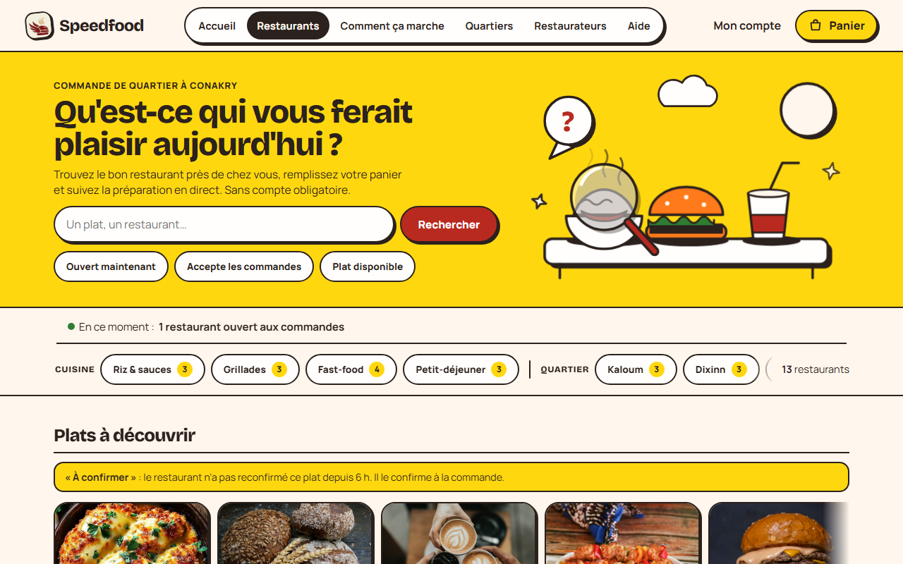

# Audit visuel — Speedfood

**État : audit ciblé réalisé le 10 octobre 2026.** Aucun code applicatif n’a été modifié. Le checkout local est `master` (`494398ecc0551fad9b8da26d70c4b8760a07e80c`); la tête GitHub consultée est différente (`05de7a81a6cc7fe496632d7f62fa0388b82e9d37`). Les résultats locaux ne sont donc pas une certification du commit distant courant.

## Méthode et preuves

- Production : Chromium/Playwright sur `/restaurants`, aux viewports demandés de 375 × 812 et 1280 × 800 px; comparaison avec le serveur local Next.js 16.3.6 à `http://127.0.0.1:3000`.
- À 375 px, Playwright a mesuré `document.documentElement.scrollWidth = 360`; à 1280 px, `scrollWidth = 1265`. Aucun débordement horizontal du document n’a été observé sur cette page.
- Les captures archivées sont dans [audit-captures](audit-captures). L’image mobile est une capture pleine page produite par le navigateur intégré et comporte une marge vide à droite; l’image bureau est une capture Chromium 1280 × 800 de la première vue.
- Le contenu public observé comprend 13 restaurants, 12 plats mis en avant et un restaurant annoncé comme ouvert aux commandes. Il s’agit de l’état visible au moment de l’audit, pas d’un engagement de disponibilité.

## V1 — Disponibilité fraîcheur peu discriminante dans les vedettes (modéré)

**Écran :** `/restaurants`, visiteur, mobile et bureau.

La section s’intitule « Plats à découvrir » et affiche une note globale : « À confirmer » signifie que le restaurant n’a pas reconfirmé le plat depuis 6 h. Les 12 vedettes observées étaient toutes à confirmer. La date ou l’heure de dernière confirmation propre à chaque plat n’est pas visible dans les cartes du carrousel; la note globale explique le seuil, mais pas l’ancienneté de chaque article.

La spécification pilote demande une information horodatée et une disponibilité périmée présentée comme incertaine. Le statut « À confirmer » est honnête et empêche de promettre la disponibilité; l’absence d’horodatage individuel réduit toutefois la capacité à comparer les résultats et la valeur du rail de découverte.

**Suite proposée :** afficher l’heure de dernière confirmation pour chaque plat quand elle existe, et donner la priorité aux disponibilités fraîches dans les vedettes. Ne pas retirer le libellé « À confirmer ».

## V2 — Liens de navigation sous la cible tactile verrouillée (mineur)

**Écran :** en-tête public de `/restaurants`, visiteur, viewport 1280 px.

Les six liens « Accueil », « Restaurants », « Comment ça marche », « Quartiers », « Restaurateurs » et « Aide » mesurent 40 px de haut selon `getBoundingClientRect()`. « Mon compte » mesurait 44 px. Le système de design fixe une cible minimale de 44 px pour les actions fréquentes; l’écart est faible mais mesurable.

**Suite proposée :** porter ces liens à 44 px sans réduire le focus visible, puis recontrôler le menu mobile et l’espacement de l’en-tête.

## Anomalie locale à recontrôler

Pendant `next dev`, Chromium a signalé un avertissement d’hydratation autour des classes/styles publics (`pub-pre`, `hors-ecran`) et un message React développement concernant `eval()` bloqué par la CSP. Le code de révélation ajoute les classes par `useEffect`/`IntersectionObserver`; les mêmes avertissements n’ont pas été observés sur la page publique de production lors de cette passe. Ne pas conclure à une régression utilisateur avant un contrôle en build de production.

## Limites

Pas d’essai clavier complet, lecteur d’écran, zoom 200/400 %, mesure de contraste exhaustive, test tactile physique, ni validation avec clients/restaurateurs. Les consoles authentifiées et les états d’erreur métier n’ont pas été parcourus faute de sessions de test de rôle disponibles. La capture exportée du navigateur intégré comporte une marge de présentation; les mesures de viewport proviennent des évaluations Playwright, pas d’une estimation visuelle de cette marge.
