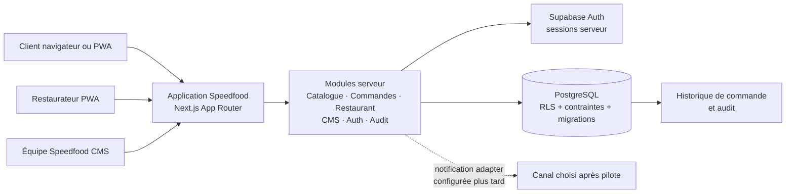
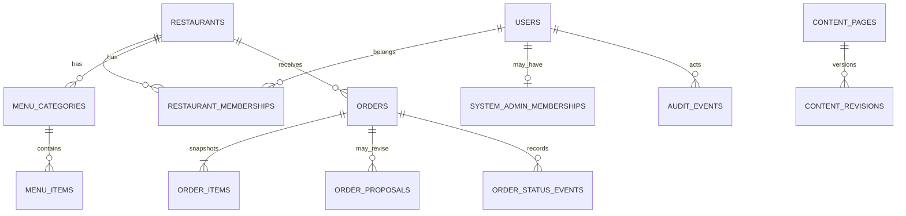

# Architecture technique et design — Speedfood

**Version :** 0.2 — proposée pour le MVP  
**Lancement pilote :** Conakry, Guinée  
**Statut :** document de conception; aucun service cloud ni paiement n’est provisionné.

## 1. Principes directeurs

1. **Un produit web installable, plusieurs espaces selon le rôle.** Catalogue client, console restaurant, CMS système et suivi de commande partagent un domaine et un socle, mais pas les permissions ni la navigation.
2. **Modular monolith au MVP.** Un déploiement applicatif, un modèle relationnel et des modules métier bien séparés. Pas de microservices avant qu’une charge ou une équipe les justifie.
3. **Le serveur décide.** Le navigateur ne décide jamais du prix final, du tenant, d’un état de commande, d’une publication ou d’une permission.
4. **Restaurant = frontière multi-tenant.** Toutes les données privées restaurant sont isolées par `restaurant_id`, membre et rôle; les données système suivent un RBAC séparé.
5. **Commande transparente et consentement sur les changements.** Une proposition de prix/frais/conditions différente du panier initial n’est applicable qu’après acceptation explicite du client.
6. **PWA prudente.** L’installation améliore l’accès; la PWA n’emmagasine ni commandes ni données privées et ne simule pas d’action hors ligne.
7. **Intégrations par ports/adaptateurs.** Push, WhatsApp, SMS, paiement et livraison restent isolés et inactifs tant qu’un choix produit et une configuration réels ne sont pas approuvés.

## 2. Schéma général



### Pile proposée

- **Interface et routes serveur :** Next.js App Router + TypeScript, rendu serveur pour les pages publiques découvrables, composants client seulement pour interactions locales.
- **Données/authentification :** PostgreSQL managé; Supabase est l’option de départ à confirmer après vérification du coût, de la région, des exigences de données et de la latence mesurée depuis Conakry.
- **Structure :** monolithe modulaire avec modules `catalog`, `restaurant`, `orders`, `system-cms`, `auth`, `notifications`, `audit`.
- **Contrats :** types et validations partagés quand c’est sûr; validation, autorisation, recalcul et transition restent côté serveur.
- **Assets :** icônes PWA versionnées au dépôt; photos uploadées seulement après décision stockage, limites, modération et politique de conservation.

Next.js documente l’App Router et le support du manifeste PWA; l’installation de production utilise HTTPS. La région Supabase est à choisir après vérification des exigences et de la latence; RLS ne dispense pas de régler les privilèges SQL.[^1][^2][^3]

## 3. Espaces et navigation

| Espace | Accès | Navigation indicative | Responsabilité |
|---|---|---|---|
| `/` et `/restaurants/[slug]` | Public | Explorer · catégories · quartier · fiche | Découverte et commande |
| `/suivi/[token]` | Client avec jeton secret de suivi | Commande · changements proposés · décision | Suivre/valider une commande sans compte |
| `/restaurant/*` | Membre authentifié de cet établissement | Accueil · Commandes · Menu · Mon restaurant | Gestion quotidienne d’un restaurant unique |
| `/system/*` | Personnel avec rôle système | Vue d’ensemble · Restaurants · Contenus · Commandes support · Audit · Accès | Opération de Speedfood |

Le client peut commander sans compte. Le restaurateur utilise une session nominative. Les membres du CMS sont affectés par invitation contrôlée; aucune inscription publique ne crée un rôle système.

## 4. Frontières des modules

### Catalogue

Lit seulement établissements publiés/actifs et champs publics minimaux. Gère recherche, catégories, quartiers et fiches. Il ne lit jamais commandes, contacts privés ou configuration opérationnelle confidentielle.

### Console restaurant

Toutes les lectures/écritures sont associées au restaurant issu de la session/membership côté serveur. Le `restaurant_id` envoyé par le navigateur ne confère aucun accès. Le tableau de bord met en avant les commandes nouvelles et les tâches urgentes; le menu permet modifier plat, prix entier GNF, disponibilité et horaires.

### Commandes

Seul module autorisé à créer les commandes, produire les snapshots de ligne, créer les propositions versionnées et transiter les états. Les opérations de création, recalcul et historisation doivent être atomiques.

### CMS système

Le CMS utilise des permissions précises, distinctes des memberships restaurant. Au MVP, les rôles système sont `super_admin`, `operations`, `content_editor` et `support`. Les vérifications sont appliquées sur chaque page, endpoint et mutation côté serveur, en complément de RLS quand la table est exposée.

### Notifications

L’état en base fait autorité. Un adaptateur peut notifier le restaurant/client mais ne modifie jamais l’état métier. Les échecs de notification ne suppriment pas une commande; le dashboard et le lien de suivi restent utilisables.

## 5. Modèle de données logique



### Entités principales

- `restaurants`: profil, slug, zones/horaire, `publication_status`, `operational_status`.
- `restaurant_memberships`: user, restaurant, rôle (`owner`, éventuellement `manager`/`staff`).
- `system_admin_memberships`: user et rôle système; jamais éditable via les permissions restaurant.
- `menu_categories`, `menu_items`: catalogue privé d’édition et projection publique contrôlée; prix GNF en entier.
- `orders`: restaurant, coordonnées minimales client, mode/service, état courant, sommes snapshot, jeton de suivi stocké sous forme de hash.
- `order_items`: nom/prix/options/quantité figés au moment de l’envoi.
- `order_proposals`: versions immuables du changement proposé; qui, quand, échéance, lignes de frais, montant total, conditions de service proposées et réponse du client. La proposition active est explicitement identifiée.
- `order_status_events`: ancien/nouvel état, acteur (client/restaurant/système), date, motif.
- `content_pages` / `content_revisions`, `content_banners`, taxonomie et sélections: CMS éditorial versionné.
- `audit_events`: accès et mutations administratives sensibles; aucune donnée PII ou secret dans le payload d’audit.

Les noms précis de tables peuvent évoluer au bloc 2, mais la sémantique d’instantané, tenant, proposition immuable et événement d’audit doit rester.

## 6. Flux de commande et nouvelle confirmation client

```mermaid
sequenceDiagram
  actor Client
  participant Web as PWA/site
  participant API as Module commandes serveur
  participant DB as PostgreSQL
  participant R as Console restaurant

  Client->>Web: Envoie panier + contact + retrait/livraison
  Web->>API: POST create-order + clé idempotence
  API->>DB: Vérifie menu/prix/stock et crée snapshot en_attente
  DB-->>API: Référence + jeton de suivi
  API-->>Web: Demande reçue, en attente
  R->>API: Accepter sans changement / refuser / proposer révision
  API->>DB: Vérifie membre, enregistre événement et version
  alt Conditions initiales acceptées
    API->>DB: Transition acceptee
    API-->>Client: Statut accepté
  else Prix/frais/conditions révisés
    API->>DB: Crée order_proposal (commande reste en_attente, état affiché attente_confirmation_client)
    API-->>Client: Diff initial/proposé + total + échéance
    Client->>API: Accepter ou refuser la version active
    API->>DB: Vérifie jeton, version, échéance; enregistre décision
    alt Acceptation explicite
      API->>DB: Transition acceptee; préparation désormais permise
    else Refus ou échéance
      API->>DB: Proposition refusee ou expiree; commande annulee
    end
  end
```

### Invariants métier

- Le restaurant ne peut pas marquer `acceptee`, `prete` ou `terminee` tant qu’une révision attend l’accord du client.
- Le client accepte uniquement la proposition active, identifiée par version; un clic en double est idempotent et une version supersédée est refusée.
- L’écran présente avant/après : sous-total, frais de livraison, total, méthode, zone, délai ou autres conditions modifiées.
- Un refus du client annule la commande; une proposition expirée ne peut plus être acceptée. La durée d’échéance doit être choisie avec le pilote.
- Aucune somme n’est encaissée par Speedfood au MVP. « Acceptée » signifie conditions convenues, pas paiement reçu.
- Chaque décision est horodatée et attribuée; le client peut retrouver la demande avec son lien secret sans créer de compte.

## 7. Autorisations et sécurité

| Action | Public/client | Membre restaurant | Operations | Content editor | Support | Super admin |
|---|---:|---:|---:|---:|---:|---:|
| Lire catalogue publié | Oui | Oui | Oui | Oui | Oui | Oui |
| Modifier son menu/profil | Non | Oui, son restaurant | Non par défaut | Non | Non | Selon procédure |
| Voir commandes complètes du restaurant | Avec token de suivi, données minimisées | Oui, son restaurant | Selon incident et masqué | Non | Masqué par défaut | Permission auditée |
| Publier/suspendre établissement | Non | Non | Oui | Non | Non | Oui |
| Modifier pages/FAQ/taxonomie | Non | Non | Non par défaut | Oui | Non | Oui |
| Gérer les rôles système | Non | Non | Non | Non | Non | Oui |

RLS/grants protègent les lignes à la base; les appels privilégiés restent côté serveur et les secrets service-role ne sont jamais embarqués dans la PWA. L’accès de support à un numéro/adresse exige permission dédiée, motif et audit.

## 8. Design d’expérience

### Identité visuelle de départ

**Palette retenue :** rouge piment `#D9362B` en couleur de marque, orange mandarine `#FF7A1A` en accent et appels à l’action, jaune mangue `#FFC247` en touche secondaire, crème `#FFF6ED` pour le fond, blanc chaud `#FFFEFC` pour les surfaces et brun encre `#2B211D` pour le texte. Utiliser le rouge et l’orange de façon visible sans peindre de grands panneaux de CMS entièrement saturés. Préserver les couleurs sémantiques (succès, avertissement, erreur, information) et accompagner chaque état d’un libellé ou d’une icône.

**Typographie retenue :** Barlow Condensed pour le logotype, les grands titres et les accroches; Manrope pour le texte, les menus, les contrôles, les montants et toutes les interfaces du CMS. Le système complet de tailles, graisses et usage est décrit dans [DESIGN-SYSTEM.md](DESIGN-SYSTEM.md). Les spécimens officiels sont consultables sur [Google Fonts — Barlow Condensed](https://fonts.google.com/specimen/Barlow+Condensed) et [Google Fonts — Manrope](https://fonts.google.com/specimen/Manrope).

Le nom de marque est **Speedfood**; le monogramme, le logo, le domaine et les assets finaux restent à valider avant commercialisation. Le style des composants et des icônes est une proposition détaillée dans [DESIGN-SYSTEM.md](DESIGN-SYSTEM.md), à confirmer avant le développement visuel complet.

### Architecture d’interface

- **Client :** page d’accueil avec recherche proéminente, catégories, résultats en cartes; fiche restaurant avec statut/horaire, menu organisé; panier mono-restaurant; formulaire de commande simple; suivi qui met la confirmation en évidence.
- **Étape de modification :** bandeau « Le restaurant propose un changement »; tableau lisible « demandé / proposé »; ventilation du frais et nouveau total; boutons séparés « Accepter la nouvelle proposition » et « Refuser et annuler »; aucun bouton ambigu ni sélection précochée.
- **Restaurant :** accueil focalisé sur la file « À traiter », puis onglets Accueil, Commandes, Menu, Mon restaurant. Actions urgentes en gros boutons; formulaire de plat court; bascule disponibilité en une action; statuts en mots simples.
- **CMS système :** navigation latérale par domaine; tables avec recherche/filtres, fiche détail et panneau d’action contextualisé; prévisualisation contenu; confirmation pour publication/suspension; rôle visible et information PII masquée par défaut.
- **Composants transverses :** bannière réseau hors ligne, notification de réussite/erreur, états skeleton/vide, confirmation d’action irréversible, contrôles clavier et focus.

## 9. PWA et disponibilité réseau

- Le portail marche comme site sans installation; l’ajout à l’écran d’accueil est proposé seulement avec aide adaptée à la plateforme.
- En cache : shell et assets versionnés uniquement. Pas de menus dynamiques, API, session, commandes, PII ou CMS.
- Hors ligne : page expliquant la perte de connexion et les actions indisponibles. Un envoi n’est « réussi » qu’après reçu serveur.
- Pas de notification push jusqu’à validation du canal et des appareils réellement employés.

## 10. Déploiement logique

- Environnements distincts : local, préproduction, production.
- Variables différentes par environnement; aucune valeur secrète commitée.
- Migrations revues/versionnées; sauvegarde et restauration avant données réelles.
- Choix fournisseur/région après benchmark, sécurité et vérification des obligations de données.
- Déploiement initial en une région proche selon mesure; CDN peut servir assets publics, jamais cache de réponses privées.
- Journaux d’erreur et audit séparés; règles de rétention définies avant pilote.

## 11. Points ouverts à décider au gel de conception

1. Durée d’expiration d’une proposition et comportement de commande expirée.
2. Champs exacts modifiables par le restaurant lors d’une proposition (frais/délai/zone/méthode; changement de plats/substitution à décider séparément).
3. Confirmation d’acceptation par le client : page de suivi et canal de notification réellement configuré.
4. Jusqu’où `support` peut consulter les commandes et quelles données restent masquées.
5. Besoin d’images/plats et fournisseur de stockage.
6. Région/base d’hébergement et rétention après validation locale.

[^1]: [Next.js App Router](https://nextjs.org/docs/app)
[^2]: [Guide officiel PWA Next.js](https://nextjs.org/docs/app/guides/progressive-web-apps)
[^3]: [Supabase RLS et régions](https://supabase.com/docs/guides/database/postgres/row-level-security) · [Régions Supabase](https://supabase.com/docs/guides/platform/regions)

## Addendum architecture — découverte fiable et identité (3 octobre 2026)

La spécification fonctionnelle prioritaire est `SPEC-PILOTE-DISCOVERY-IDENTITE-DESIGN.md`. Ajouter au modèle logique : coordonnées/repères de restaurant facultatifs, statuts opérationnels et horodatage, état de disponibilité par article, vocabulaire contrôlé de plats/synonymes et événements d’usage minimaux. Les favoris/follows ne sont requis que si l’espace « restaurants suivis » est retenu P1.

Le moteur de découverte suit l’ordre : filtres durs demandés → groupes de correspondance exact/disponible, exact/à confirmer, équivalent confirmé, suggestions → score déterministe comprenant correspondance, fraîcheur, proximité facultative, ouverture/commandes et complétude. Distance manquante ne doit jamais être inventée; géolocalisation client facultative, quartier manuel en alternative; ne pas stocker les coordonnées précises du client par défaut.

Les règles de disponibilité sont déclaratives et attribuées au restaurant, avec `updated_at`/acteur; les commandes ne décrémentent pas un inventaire global non fiable. Le statut ancien s’affiche « à confirmer ». Partage WhatsApp ouvre un lien externe prérempli, et n’est pas un adaptateur de notification/commande.

Supabase Auth est proposé pour Google OAuth et OTP téléphone; normaliser +224, activer les SMS seulement après validation réelle d’un prestataire en Guinée. Aucun secret OAuth/SMS dans le navigateur; quotas, limitation de débit et récupération de compte font partie de la revue sécurité.

## Addendum — modèle des notifications et dépendances UI

Le toast et la modal de la démo restent locaux au frontend. Les événements de commande durables sont dérivés du serveur; prévoir `notification_events` (type, user/restaurant destinataire, référence métier, horodatage, lu/affiché, déduplication) si un centre in-app est retenu. Pour Web Push post-MVP, prévoir `push_subscriptions` rattaché à un compte et à un appareil avec consentement, révocation, date de dernière activité et état; considérer les endpoints et clés de souscription comme secrets. Les payloads restent minimaux et ne contiennent pas de téléphone/adresse/détail sensible.

La diffusion push passe par un adaptateur distinct, sélectionné après un prototype technique. FCM est candidat; aucun SDK/provider supplémentaire ne doit devenir une deuxième source d’identité ou de données métier. En l’absence de consentement/support push, le suivi et les événements in-app continuent de fonctionner. Consulter `NOTIFICATIONS-ICONES-OUTILS.md` pour la shortlist d’outils et le phasage.
