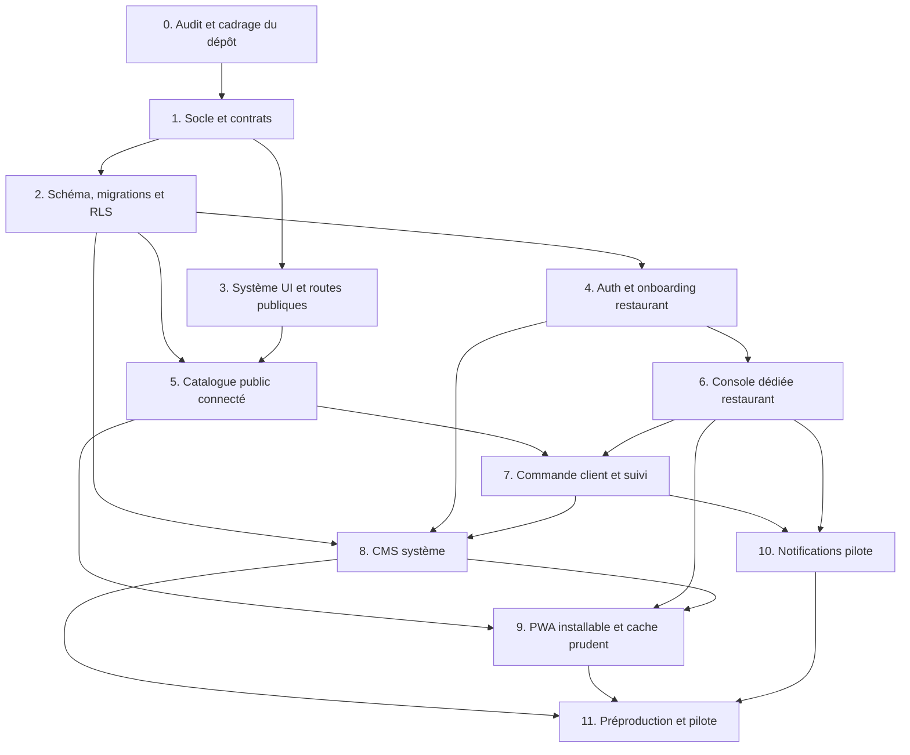

# Plan d’exécution et lots délégables — Speedfood

**But :** transformer le prototype en MVP SaaS de pilote.  
**Approche :** contrats et sécurité d’abord; blocs verticaux; services externes après validation terrain.  
**Règle de délégation :** un seul agent par bloc, propriétaires de fichiers assignés avant exécution. Les délais sont volontairement omis : ils dépendent du nombre d’agents, de l’accès au dépôt et des choix ouverts.

## Vue d’ensemble et dépendances

Blocs parallélisables après acceptation du socle : 2 et 3 (fichiers isolés); puis 4 et 5 après schéma figé (routes/types/fichiers différents). Après gel des rôles système du bloc 8a, les sous-blocs 8b et 8c peuvent avancer en parallèle s’ils gardent des fichiers séparés; 8d dépend du parcours commande. Le bloc 9 PWA n’est pas autorisé à mettre en cache les routes privées. Le bloc 10 notification ne choisit aucun fournisseur avant décision produit.

## Bloc 0 — Audit du dépôt et reprise du prototype

**Type :** agent d’audit / intégration.  
**Dépendances :** aucune.

**Tâches**

- Inspecter l’arborescence, instructions locales, Git, pile existante et état des fichiers.
- Identifier l’emplacement du prototype (`outputs/portail-restaurants`) et décider s’il sera migré ou gardé comme référence visuelle.
- Comparer le code présent au TDR; lister ce qui peut être réutilisé sans transporter les données fictives en production.
- Produire un inventaire des commandes de développement, construction et contrôle réellement disponibles.

**Livrables :** audit bref, plan de migration, questions bloquantes.  
**Acceptation :** aucune modification destructive; aucune pile imposée avant inspection; les travaux et données fictives sont identifiés.

**Prompt à déléguer :** « Fais l’audit du dépôt selon le bloc 0. Ne modifie aucun fichier. Rends l’état Git, les conventions, la pile existante, les risques de reprise et une proposition de socle alignée sur les ADR. »

## Bloc 1 — Socle de l’application et contrats communs

**Type :** agent architecture/scaffold.  
**Dépendances :** bloc 0 accepté.

**Tâches**

- Créer ou adapter le projet Next.js App Router + TypeScript selon ADR-002; utiliser les versions supportées au moment de l’installation.
- Configurer lint/typecheck/scripts et alias selon conventions choisies.
- Créer `.env.example`, ignorer les fichiers secrets, ajouter README de développement local.
- Définir types partagés et contrats d’API/erreurs pour Restaurant public, MenuItem, Order, OrderItem, membership, statuts.
- Ajouter navigation/layout responsive minimal et pages placeholder publiques, restaurant, admin.
- Garder le prototype comme référence, sans recopier ses prix/adresses fictifs comme données réelles.

**Fichiers possédés :** `package.json`, config TypeScript/framework, `src/app/layout.*`, `src/lib/contracts/*`, `.env.example`, README racine.  
**Acceptation :** application locale démarre avec étapes documentées; types métier uniques; aucun secret ni intégration fantôme; aucun lot indépendant ne démarre avant acceptation du contrat.

## Bloc 2 — Base de données, migrations et isolation tenant

**Type :** agent backend/data/security.  
**Dépendances :** bloc 1 accepté; ADR-003/004/011 confirmés par le propriétaire.  
**Statut : FAIT** (voir `docs/STATUT-PROJET.md`). Le schéma existe dans le projet Supabase `ggldjdizqrtpetdiohxy` (25 migrations, toutes versionnées dans `supabase/migrations/`, RLS partout, fonctions de sécurité). Les tâches ci-dessous décrivent le périmètre d'origine; toute évolution passe désormais par une **nouvelle migration versionnée**, jamais par la modification d'une migration existante ni par un changement direct en base sans fichier correspondant.

**Tâches**

- Créer migrations versionnées pour `restaurants`, `restaurant_memberships`, `system_admin_memberships`, `menu_categories`, `neighborhoods`, `menu_items`, `orders`, `order_items`, `order_proposals`, `order_status_events`, `content_pages`, `content_banners`, `featured_placements` et `audit_events`, avec les seuls champs nécessaires.
- Définir enums/check constraints, clés étrangères, index, horodatages et stratégie d’effacement/archivage.
- Activer RLS et privilèges minimaux sur chaque table accessible via API; ajouter policies publiques limitées au contenu publié et policies de membre au restaurant associé.
- Définir les vues/champs publics sans contacts privés.
- Prévoir seeds de développement explicitement fictifs et séparés des environnements pilotes.
- Documenter choix de région et variables sans créer de projet Supabase.

**Fichiers possédés :** `supabase/migrations/*`, `supabase/seed.*`, `src/lib/db/*` ou équivalent, doc modèle de données.  
**Acceptation :** migration depuis base vide; RLS partout où exposé; accès d’un membre A refusé aux données de B; visiteur ne voit que restaurants publiés; clé privilégiée absente du navigateur; montants en GNF entiers.

## Bloc 3 — Design system et shell responsive

**Type :** agent frontend/accessibilité.  
**Dépendances :** blocs 0–1 acceptés; peut se dérouler en parallèle du bloc 2.  
**Fichiers possédés :** `src/components/ui/*`, `src/app/globals.css`, composants de navigation partagés uniquement après accord.

**Brief d’exécution des écrans :** appliquer `FRONTEND-DESIGN-BRIEF.md`. Le bloc commence par l’inventaire des écrans et les wireframes basse fidélité des trois surfaces; après revue produit, il livre le prototype haute fidélité interactif des parcours P0. Le développement des composants réutilisables peut avancer en parallèle, mais les écrans ne sont pas considérés comme spécifiés par le seul shell responsive.

**Démo existante :** commencer par `PARCOURS-CIBLE-CLIENT-MVP.md` et inspecter `index.html`, `styles.css`, `app.js`. Consigner les écrans/composants réutilisables, les données/actions fictives et les écarts au parcours. Faire évoluer cette démo de manière incrémentale; ne pas jeter ni remplacer l’interface complète sans motif concret et validation du propriétaire produit.

**Tâches**

- Traduire l’identité du prototype en composants réutilisables sans importer ses restaurants/prix fictifs.
- Produire l’inventaire, la carte des parcours et les wireframes mobile/desktop décrits dans `FRONTEND-DESIGN-BRIEF.md`; consigner le retour produit et les décisions ouvertes avant de figer les maquettes haute fidélité.
- Réaliser un prototype haute fidélité navigable couvrant tous les écrans P0 et les scénarios de revue A–G du brief. Garder clairement simulées les actions non connectées.
- Suivre `DESIGN-SYSTEM.md` : palette rouge/orange, Barlow Condensed + Manrope et le système d’icônes au trait arrondi retenu par le propriétaire produit.
- Construire header, navigation, boutons, champs, cartes, badges, alertes, statuts, commandes, tableaux CMS et composants skeleton/empty/error.
- Utiliser un seul style d’icônes SVG cohérent; retirer les emoji des contrôles et de la navigation. Les photos/illustrations de plats restent des médias éditoriaux, pas des icônes d’interface.
- Vérifier mobile étroit, clavier, focus, libellés, contrastes et préférences de réduction de mouvement.
- Garder les textes métier en français et centraliser formatage date/GNF.

**Acceptation :** wireframes revus; tous les écrans P0 et scénarios du brief sont représentés dans le prototype; tous les composants ont états interactifs visibles; couleurs et tailles respectent `DESIGN-SYSTEM.md`; mise en page sans débordement mobile; navigation clavier cohérente; pas de dépendance visuelle externe obligatoire. Les écrans doivent ensuite rester conformes au prototype lors de leur intégration dans les blocs 5–9.

## Bloc 4 — Authentification et onboarding restaurant

**Type :** agent identité/backend.  
**Dépendances :** blocs 2 et 3 acceptés; contrat de membership gelé.  
**Fichiers possédés :** `src/app/(auth)/*`, `src/app/api/auth/*` si utilisées, `src/lib/auth/*`, formulaires d’onboarding.

**Tâches**

- Configurer Supabase Auth en cookies serveur selon la documentation officielle courante.
- Définir inscription sur invitation ou validation manuelle; par défaut, restaurant non publié jusqu’à validation admin.
- Créer flux connexion, déconnexion, récupération accès et erreurs compréhensibles.
- Créer premier profil restaurant et membership owner dans une transaction/procédure sûre.
- Protéger les routes au serveur; contrôle d’interface seul interdit.

**Acceptation :** visiteur non connecté refusé sur routes privées; compte restaurateur lié au bon restaurant; session et récupération documentées; politique RLS testée sans élévation de privilège côté navigateur.

## Bloc 5 — Catalogue public connecté

**Type :** agent frontend/catalogue.  
**Dépendances :** blocs 1–3 acceptés, contrat public du bloc 2 gelé.  
**Fichiers possédés :** routes publiques catalogue/restaurant et composants associés; aucun fichier admin/auth.

**Tâches**

- Implémenter liste de restaurants publiés/actifs, recherche, filtre catégorie/quartier et page restaurant.
- Lire les données publiques avec pagination ou limites explicites; ne pas divulguer contacts ou données de gestion.
- Prévoir menu vide, restaurant suspendu, recherche vide, erreur et chargement.
- Conserver URL partageable pour restaurant/catégorie si pertinent.

**Acceptation :** seuls restaurants approuvés; filtres cumulables sans résultats fictifs; menu et prix tirés de données serveur; version mobile utilisable; erreurs expliquées.

## Bloc 6 — Espace restaurant et gestion du menu

**Type :** agent frontend/backend métier.  
**Dépendances :** blocs 2–4 acceptés.  
**Fichiers possédés :** route dashboard restaurant, composants menu, handlers CRUD de menu.

**Tâches**

- Afficher et modifier profil, horaires, catégories, plats, prix GNF entiers et disponibilité.
- Valider les champs côté serveur, borner longueurs et valeurs, protéger image/URL si inclus.
- Créer les états actif/indisponible/archivé; empêcher la suppression de données référencées par commande sans stratégie explicite.
- Exiger membership et rôle correspondant pour chaque mutation.
- Concevoir la console pour un restaurateur peu à l’aise avec les logiciels : accueil centré sur « commandes à traiter », menu à actions simples, boutons tactiles visibles, vocabulaire sans jargon et parcours de configuration guidé.
- Regrouper la navigation en tâches compréhensibles : Accueil, Commandes, Menu, Mon restaurant. Ajouter un accès rapide pour fermer temporairement le restaurant et marquer un plat indisponible.
- Prévoir états vides avec prochaine action claire, confirmations avant actions sensibles, et aide/contact du support.
- Gestion des membres équipiers simple; ne pas bloquer le parcours propriétaire pour une gestion avancée d’équipe.

**Acceptation :** restaurant A ne lit ni ne modifie B; valeur invalide rejetée côté serveur; prix historique des commandes demeure inchangé après édition; confirmation de sauvegarde visible. Un nouvel utilisateur termine les tâches principales avec des libellés simples, sans naviguer dans le CMS système.

## Bloc 7 — Panier, création de commande et suivi client

**Type :** agent parcours de commande.  
**Dépendances :** blocs 2, 3, 5 et 6 acceptés; schéma/order contract gelé.  
**Fichiers possédés :** panier/checkout public, endpoint création commande, page de suivi, handlers statut à coordonner avec bloc 6.  
**Note d’architecture :** le parcours invité passe par des routes serveur avec `service_role` (ADR-011); aucune politique RLS `anon` n’est ajoutée sur les tables de commande. **Statut : FAIT**; limitation de débit ajoutée le 3 octobre 2026 (voir ADR-011, état réel).

**Tâches**

- Faire respecter panier mono-restaurant.
- Créer commande invitée avec données minimales, validation téléphone selon règle retenue, adresse conditionnelle et consentement/info de confidentialité approprié.
- Recalculer quantité, disponibilité, prix et total côté serveur; utiliser idempotency pour éviter double soumission accidentelle.
- Créer snapshot de lignes, statut initial `en_attente`, événement d’audit, référence publique et jeton opaque de suivi.
- Si le restaurant modifie prix total, frais ou conditions de livraison, créer une proposition immuable versionnée (`order_proposals`); la commande reste `en_attente` et son état dérivé affiché est `attente_confirmation_client`; montrer au client valeurs initiales et proposées, frais détaillés, nouveau total et échéance.
- Permettre au client invité d’accepter ou refuser depuis le suivi protégé; n’accepter que la proposition active/version courante et traiter la réponse de façon idempotente. Refus = commande annulée; absence de réponse jusqu’à l’échéance = proposition expirée et aucune préparation. Définir une durée d’échéance configurable ou une valeur pilote décidée avant implémentation.
- Créer transitions serveur valides, actions restaurant accepter/refuser/prête/terminée, et rafraîchissement visible côté client.
- Présenter explicitement le mode de règlement hors portail et la confirmation requise.

**Acceptation :** prix manipulé par le client sans effet; plat désactivé/refusé; duplication réseau maîtrisée; jeton de suivi imprévisible et non divulgué dans logs; transitions invalides rejetées; suivi n’expose pas téléphone/adresse. Si une proposition change prix/frais/conditions, état dérivé `attente_confirmation_client`; aucune acceptation ni préparation avant accord sur la version active; refus/expiration terminent la commande sans frais encaissés.

## Bloc 8 — CMS complet de l’administration système

Le CMS interne couvre les opérations du portail : onboarding/modération, restaurants/comptes, taxonomie, contenus, support commande, visibilité et audit. « Complet » désigne ce périmètre pilote, pas un constructeur de site généraliste.

### Bloc 8a — Rôles système, matrice de permissions et shell

**Type :** agent architecture/admin sécurité.  
**Dépendances :** blocs 2 et 4; TDR/ADR rôles acceptés.  
**Fichiers possédés :** `src/lib/system-admin/*`, protection `/system`, contrat de permission versionné.

**Tâches :** définir RBAC système distinct des memberships restaurant (`super_admin`, `operations`, `content_editor`, `support`) avec matrice de permissions; définir l’accès masqué aux coordonnées; protéger chaque page/action/endpoint côté serveur; créer le shell `/system`; définir attribution initiale et récupération contrôlées du super-admin.

**Acceptation :** propriétaire restaurant ne peut pas se donner un rôle système; permissions serveur vérifiables; matrice acceptée avant branchement des autres sous-blocs; données personnelles masquées par défaut.

### Bloc 8b — Opérations restaurants et comptes

**Type :** agent frontend/backend CMS.  
**Dépendances :** 8a accepté, modèle restaurant/membership du bloc 2 gelé.  
**Fichiers possédés :** routes/composants `system/restaurants` et `system/accounts`.

**Tâches :** demandes et établissements, recherche/filtres, aperçu de la fiche publique, approuver/demander correction/suspendre/réactiver avec motif, inviter/révoquer propriétaires et équipiers avec traces, afficher dates et états.

**Acceptation :** seuls `operations` ou `super_admin` modèrent et affectent les membres; établissement suspendu retiré du portail public; changement sensible avec auteur, horodatage et motif.

### Bloc 8c — CMS éditorial et taxonomie

**Type :** agent CMS contenu.  
**Dépendances :** 8a accepté.  
**Fichiers possédés :** routes/composants `system/content` et `system/taxonomy`; aucun composant de navigation partagé.

**Tâches :** gérer catégories, cuisines, quartiers, tags, ordre d’affichage, sélections/mises en avant; créer, modifier, prévisualiser, publier et dépublier pages d’aide/FAQ, bannières et contenus d’accueil; valider et prévisualiser sur mobile.

**Acceptation :** `content_editor` ne modifie ni commande ni rôle; chaque contenu porte auteur, date et état brouillon/publié; contenus non publiés jamais exposés publiquement.

### Bloc 8d — Support des commandes, indicateurs et audit

**Type :** agent opérations/data.  
**Dépendances :** 8a accepté et bloc 7 livré.  
**Fichiers possédés :** `system/orders`, `system/audit`, reporting et documentation support.

**Tâches :** recherche par référence/statut/date/restaurant, historique de transitions, téléphone/adresse masqués par défaut, accès exceptionnel avec permission et motif, indicateurs avec définitions écrites, journal filtrable des actions sensibles.

**Acceptation :** support sans lecture PII par défaut; accès exceptionnel journalisé; indicateurs définis; le support ne modifie pas une commande à la place du restaurant sans procédure explicite.

## Bloc 9 — PWA installable et cache prudent

**Type :** agent frontend/PWA.  
**Dépendances :** blocs 1, 3, 5, 6 et 8 acceptés; stratégie de cache revue par l’agent sécurité.  
**Fichiers possédés :** `src/app/manifest.ts`, icônes `public/`, service worker et composant d’aide à l’installation; ne pas modifier les routes métier.

**Tâches**

- Définir manifest, nom court, couleurs, icônes adaptées et `display: standalone`.
- Fournir une aide d’installation progressive selon l’appareil; ne pas dépendre d’une API de prompt non disponible sur tous les navigateurs.
- Construire le shell hors ligne et une stratégie de cache limitée au shell et aux assets statiques versionnés; afficher une page explicative hors connexion.
- Ne pas mettre en cache menus dynamiques ni aucune API; exclure explicitement commande/suivi, authentification, cookies, pages restaurant privées, CMS et réponses contenant des données personnelles.
- Afficher l’état hors ligne et désactiver clairement toute mutation; aucune file de commande hors ligne.
- Documenter HTTPS en production, mise à jour et invalidation du service worker; préciser les navigateurs ciblés.
- Ne pas activer le push ni demander une permission de notification dans ce bloc.

**Acceptation :** l’application reste utilisable dans un navigateur sans installation; installation testée sur appareils ciblés via HTTPS; hors ligne, seule une page sûre/shell statique est accessible; cache vérifié sans menus dynamiques, sessions, commandes, suivi, PII ou routes privées; stratégie d’actualisation documentée.

## Bloc 10 — Notifications du pilote

**Type :** agent intégrations, après découverte terrain.  
**Dépendances :** parcours commande et dashboard acceptés; propriétaire a choisi explicitement fournisseur/canal et fournit configuration autorisée.  
**Tâches :** définir adaptateur, message minimal, retries, état d’échec, opt-out si nécessaire, solution de secours via dashboard.  
**Acceptation :** aucune notification ne change statut de commande; erreur fournisseur n’efface pas la commande; secrets serveur seulement; mode sans configuration n’annonce pas un envoi réussi.  
**Bloc bloqué par défaut :** ne pas démarrer l’intégration réelle avant décision.

## Bloc 11 — Préproduction, exploitation et préparation pilote

**Type :** agent release/revue, jamais publication automatique.  
**Dépendances :** blocs 0–10 choisis pour le pilote acceptés; région, hébergeur, privacy et conditions du pilote validés par le propriétaire.

**Tâches**

- Documenter environnements, variables, build/deploy, migrations et retour arrière.
- Configurer sauvegardes, rétention, journaux, alertes d’erreur et procédure incident sans exposer données personnelles.
- Vérifier domaines/cookies, TLS, contrôles d’accès, headers de sécurité, limites de débit, secrets et accès admin.
- Préparer checklist d’onboarding des restaurants, support et procédure de fermeture/suppression des données.
- Produire un rapport « prêt / bloqué »; ne pas déployer ou créer ressources payantes sans demande explicite.

**Acceptation :** déploiement reproductible en préproduction; restauration documentée et exercée si autorisée; risques connus attribués; aucun secret dans artefacts; accord explicite requis avant lancement public.

**Porte sécurité obligatoire :** appliquer `PROCEDURE-SECURITE.md`, fournir les preuves de la section 7 et faire réaliser une revue indépendante. Une case non vérifiée bloque les données réelles ou la fonction concernée. Le rapport final distingue « prêt », « bloqué » et « non vérifié »; il ne constitue pas une certification.

## Revues transversales à planifier

### Revue sécurité/données

- Accès inter-tenant et rôle administrateur.
- Séparation membership restaurant/RBAC système et matrice de permissions du CMS.
- Cache PWA audité pour absence de données privées et invalidation correcte.
- RLS + grants, validation serveur, CSRF/session selon architecture, limitation brute force/spam.
- Gestion des jetons de suivi, journaux, sauvegardes et suppression.
- Absence de valeurs secrètes dans bundle navigateur ou dépôt.

### Revue produit/usabilité

- Première visite sur mobile lent; commande sans compte; erreurs téléphone/adresse; rupture de stock; refus et annulation; restaurateur absent; menu fermé.
- Tests de compréhension de la console restaurant avec restaurateurs peu technophiles; observer erreurs de menu et de traitement de commande.
- Tests des rôles opérations, contenu et support pour confirmer la séparation réelle dans le CMS.
- Confirmer la rédaction française avec utilisateurs locaux et ne pas publier de faux avis/notations.

### Revue pilote

- Recruter une cohorte restreinte dans une zone confirmée à Conakry.
- Former les restaurateurs; surveiller disponibilité et temps de réponse.
- Recueillir mesures et entretiens sans utiliser les coordonnées au-delà de la finalité annoncée.
- Décider après résultats : poursuivre, réviser le segment, tarifer ou arrêter.

## Liste de vérification avant chaque délégation

- [ ] Bloc assigné avec identifiant et critères recopiés.
- [ ] Agent a lu brief commun, TDR, ADR et consignes locales.
- [ ] Fichiers possédés et fichiers interdits annoncés.
- [ ] Dépendances acceptées, contrats de données/API disponibles.
- [ ] Pas de service payant ou ressource externe implicitement autorisé.
- [ ] Résultat attendu et format de compte rendu convenus.

## Addendum lots délégués — discovery, disponibilité et comptes (3 octobre 2026)

Les formulations de tâches antérieures sont complétées par `SPEC-PILOTE-DISCOVERY-IDENTITE-DESIGN.md`. Ne pas considérer ce lot comme permission d’ajouter les intégrations externes payantes ou de lancer en production.

### Bloc 4a — Connexion Google et téléphone

**Dépendances :** identité/membership du bloc 4 accepté, fournisseur SMS et configuration OAuth décidés par le propriétaire.  
**Tâches :** Google OAuth avec autorisations minimales; saisie normalisée +224 et OTP via fournisseur serveur uniquement après test de livraison/coût; UX alternative si SMS indisponible; association contrôlée des méthodes au même compte; limites de débit/CAPTCHA; aucune fusion par simple correspondance d’identité.  
**Acceptation :** aucun secret côté client; Google redirect vérifié; OTP jamais simulé; numéros non logués en clair; visite publique accessible sans compte; rapport de couverture/coût SMS prêt avant activation.

### Bloc 5a — Recherche et classement explicable

**Dépendances :** modèles publics, taxonomie et états opérationnels acceptés; décisions quartiers/repères terrain.  
**Tâches :** recherche article/restaurant; filtres ouverts/commandes actives/disponibilité; groupes exact, à confirmer, équivalent, suggestion; classement par règles selon spécification; localisation facultative et quartier manuel; distances non promises; états vide/erreur/localisation refusée.  
**Acceptation :** aucune suggestion ne remplace l’article silencieusement; sponsorisé futur est séparé; le client comprend la fraîcheur et peut rechercher sans GPS.

### Bloc 6a — Disponibilité article et statut restaurant

**Dépendances :** bloc 2 migrations/RLS et bloc 6 console.  
**Tâches :** bascules ouvert/fermé, commande active/en pause et article disponible/indisponible/à confirmer; heure de dernière confirmation; fermeture temporaire facultative; endpoints autorisés par restaurant; affichage public filtré. Pas d’inventaire exact/autodécrément tant que tous les canaux de vente ne sont pas représentés.  
**Acceptation :** utilisateur comprend chaque statut; restaurant ne modifie que ses articles; résultat ancien devient à confirmer; pas de statut optimiste sans succès serveur.

### Bloc 6b — Page restaurant, publication et diffusion

**Tâches :** brouillon, complétude, preview, soumission/validation manuelle, page publique mobile, lien stable, QR/visuel si inclus, partage WhatsApp via texte prérempli.  
**Acceptation :** pages non validées non indexables/non publiques; photos avec provenance/accord; partage mène à Speedfood et n’annonce pas un envoi ou une commande réussie.

### Bloc 11a — Télémétrie pilote responsable

**Tâches :** définir événements agrégés nécessaires pour recherche, disponibilité, ouverture fiche, partage, clic WhatsApp et demandes; minimiser PII; documenter durée de conservation et définitions de métriques; Sentry/analytics uniquement selon configuration retenue.  
**Acceptation :** clic WhatsApp distinct d’une commande; pas de contenu de messages, jetons, téléphone complet ou géolocalisation précise dans événements/logs; propriétaire reçoit une explication en langage simple avant collecte.

Les écrans et critères d’acceptation correspondants sont dans le brief frontend et la spécification pilote. L’ordre de dépendance reste schéma/RLS avant mutations, puis wireframes/prototype avant intégration des écrans concernés.

Le parcours complet de bout en bout et les mesures d’ergonomie sont définis dans `PARCOURS-CIBLE-CLIENT-MVP.md`. Les écrans existants de la démo sont la base de travail : documenter la transition vers le pilote connecté écran par écran, au lieu de repartir d’un produit abstrait.

### État d'avancement des lots de l'addendum (3 octobre 2026, fin de journée)

À lire avec `docs/STATUT-PROJET.md` (détail et preuves). **Fait** = livré et déployé ; **Partiel** = livré avec des limites écrites ; **Pas commencé**.

| Lot | État | Ce qui existe, ce qui manque |
|---|---|---|
| 4a — Connexion Google et téléphone | Pas commencé | Dépend de décisions de la propriétaire (compte Google à configurer, fournisseur et coût SMS). Connexion actuelle : email et mot de passe, **double authentification facultative** livrée. |
| 5a — Recherche et classement explicable | **Fait**, sans localisation | Recherche par plat insensible aux accents, groupes exact confirmé, exact à confirmer, restaurant, épuisé ; filtres ouvert, accepte les commandes, plat disponible ; score explicable (proximité omise et renormalisée). **Manque** : localisation facultative, quartier manuel comme repère de distance, groupe « équivalent déclaré ». |
| 6a — Disponibilité article et statut restaurant | **Fait** | Trois états distincts (ouvert, accepte les commandes, plat disponible horodaté), seuil de fraîcheur réglable (6 h), horodatage imposé par la base, bascules confirmées par le serveur, « Tout reconfirmer disponible ». |
| Alternatives en cas de rupture (SPEC 3.3) | **Partiel** | Page « Trouver ailleurs » : même plat confirmé, même plat à confirmer, suggestions de la même cuisine ; jamais de substitution au panier. **Manque** : équivalent déclaré par le restaurateur, distance, lien pour un restaurant fermé ou en pause. |
| 6b — Page restaurant, publication et diffusion | **Partiel** | Page publique mobile, validation manuelle par l'équipe, photo, logo, couleur de marque, sections de menu. **Manque** : partage WhatsApp prérempli, QR code, aperçu avant publication. |
| 11a — Télémétrie pilote responsable | Pas commencé | Aucun événement mesuré ; à définir avec la propriétaire avant toute collecte. |
| 9 — PWA installable | Pas commencé | Ni manifest ni service worker. |
| 10 — Notifications du pilote | Pas commencé, **bloquant pour le pilote** | Canal à choisir avec la propriétaire (WhatsApp, notification de l'application installée, SMS) ; voir bloc 11b. |
| 11 — Préproduction, exploitation | **Partiel** | Fait : limitation de débit, anti-robot, exports planifiés et restauration vérifiée, anonymisation automatique, plan d'incident écrit. **Manque** : préproduction, journaux d'exécution du Worker, contacts du plan d'incident, page de confidentialité, relecture indépendante des corrections. |

### Bloc 3a — Système d’icônes Speedfood et notifications de démonstration

**Dépendances :** bloc 3 et `NOTIFICATIONS-ICONES-OUTILS.md`.  
**Tâches :** inspecter et améliorer le toast déjà présent; définir toast, dialogue et badge in-app; produire un petit jeu SVG gourmand réutilisable cohérent avec les icônes fonctionnelles au trait rond. Le prototype affiche les interactions de façon honnête; aucun push serveur n’est simulé.  
**Acceptation :** clavier/lecteur d’écran pris en compte; message persistant dans le contexte quand l’erreur est importante; icônes décoratives ne remplacent pas le texte; aucune dépendance ajoutée sans justification de pile et maintenance.

### Bloc 11b — Push Web/PWA (option post-MVP)

**Dépendances :** événements transactionnels serveur stables, authentification et consentement, Service Worker/cache revus, preuve d’un besoin pilote et essai sur Android/iOS installé/desktop.  
**Tâches :** évaluer FCM ou Web Push standard; gérer abonnements par compte/appareil, stockage protégé, révocation et rotation; envoyer depuis un environnement serveur; préférences type/fréquence; déduplication et payload minimal; tester fallback in-app.  
**Acceptation :** permission demandée après action contextualisée; pas de promotion non consentie; push jamais source d’état; refus/non-support n’empêche pas le parcours; essais documentés pour appareils ciblés; aucune clé privée dans navigateur ou dépôt.
